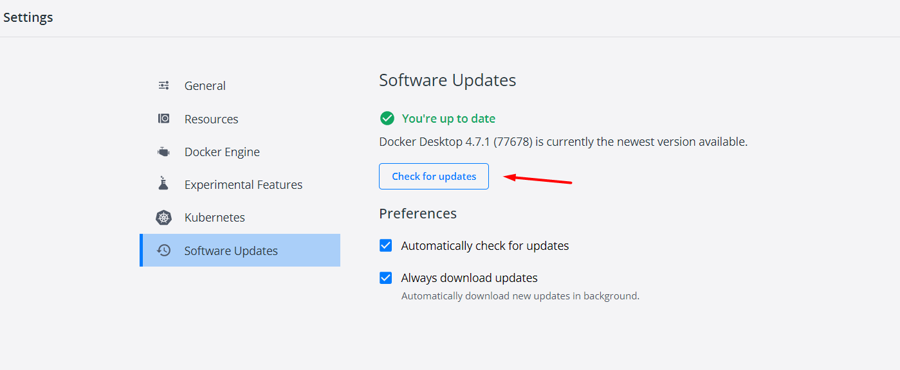
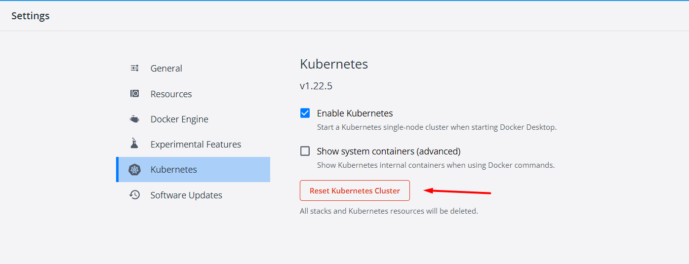

### infrastructure
`settings to deploy the project`

### requires

- install Docker Desktop for Windows / Mac

- install [skaffold](https://skaffold.dev/docs/install/) manually
- or via cmd
```shell
choco install -y skaffold
```

- install [helm](https://helm.sh/docs/intro/install/)

- install ingress controller. [Help](https://kubernetes.github.io/ingress-nginx/deploy/#quick-start).
```shell
kubectl apply -f https://raw.githubusercontent.com/kubernetes/ingress-nginx/controller-v1.2.0/deploy/static/provider/cloud/deploy.yaml
```

- check and  wait some number of minutes after running the command before the load balancer will no longer show a pending state
```shell
kubectl get svc -n ingress-nginx
```
- should be like this:


- if state is <pending>
- check for updates

- reset kubernetes
- 
- install ingress controller, see the previous step

- create a jwt-secret
```shell
kubectl create secret generic jwt-secret --from-literal=JWT_KEY=asdf
```
- to delete jwt-secret if needed
```shell
kubectl delete secret jwt-secret
```

- create a stripe-secret
```shell
kubectl create secret generic stripe-secret --from-literal STRIPE_KEY=<your secret stripe key>
```
- to delete stripe-secret if needed
```shell
kubectl delete secret stripe-secret
```

- check secrets
```shell
kubectl get secrets
```

- set NODE_ENV
macOS / OS X or Linux:
```shell
export NODE_ENV=dev
```
Windows:
```shell
SET NODE_ENV=dev
```
### deploy

#### step 1
- build docker image for `auth` service
```shell
cd auth-srv
docker build -t YOURDOCKERID/auth .
docker push YOURDOCKERID/auth
```
- build docker image for the `client`
```shell
cd client
docker build -t YOURDOCKERID/client .
docker push YOURDOCKERID/client
```

- build docker image for the `tickets` service
```shell
cd tickets-srv
docker build -t YOURDOCKERID/tickets .
docker push YOURDOCKERID/tickets
```

- build docker image for the `orders` service
```shell
cd orders-srv
docker build -t YOURDOCKERID/orders .
docker push YOURDOCKERID/orders
```

- build docker image for the `expiration` service
```shell
cd expiration-srv
docker build -t YOURDOCKERID/expiration .
docker push YOURDOCKERID/expiration
```

- build docker image for the `payments` service
```shell
cd payments-srv
docker build -t YOURDOCKERID/payments .
docker push YOURDOCKERID/payments
```

#### step 2
- start deployment
```shell
cd infrastructure
scaffold dev #./scaffold.exe dev
```

#### result
Give `skaffold` a little time to start up. 
You should then be able to access the app in your browser at `kubernetes.docker.internal`

- Postman:
- GET request to the `/api/users/currentuser` returns
```json
{
    "currentUser": null
}
```
#### how to get all pods
- kubectl get pods
#### how to rich out db inside the service
- kubectl exec -it <podname> mongo
#### how to delete pod (sometimes needed to fix issues)
- kubectl delete <podname>
