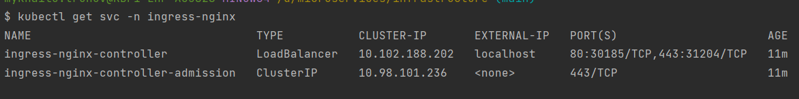

### infrastructure
`settings to deploy the project`

### requires

- install Docker Desktop for Windows / Mac

- install [skaffold](https://skaffold.dev/docs/install/) manually
- or via cmd
```shell
choco install -y skaffold
```

- install [helm](https://helm.sh/docs/intro/install/)

- install ingress controller. [Help](https://kubernetes.github.io/ingress-nginx/deploy/#quick-start).
```shell
kubectl apply -f https://raw.githubusercontent.com/kubernetes/ingress-nginx/controller-v1.2.0/deploy/static/provider/cloud/deploy.yaml
```

- check and  wait some number of minutes after running the command before the load balancer will no longer show a pending state
```shell
kubectl get svc -n ingress-nginx
```
- should be like this:



- if state is <pending>
- check this [resolve](https://globallogic.udemy.com/course/microservices-with-node-js-and-react/learn/lecture/19493770#questions/16986940)

- create a secret
```shell
kubectl create secret generic jwt-secret --from-literal=JWT_KEY=asdf
```
- to delete secret if needed
```shell
kubectl delete secret jwt-secret
```

- set NODE_ENV
macOS / OS X or Linux:
```shell
export NODE_ENV=dev
```
Windows:
```shell
SET NODE_ENV=dev
```
### deploy

#### step 1
- build docker image for auth service
```shell
cd auth-srv
docker build -t YOURDOCKERID/auth .
docker push YOURDOCKERID/auth
```
- build docker image for the client
```shell
cd client
docker build -t YOURDOCKERID/client .
docker push YOURDOCKERID/client
```

- build docker image for the tickets
```shell
cd tickets-srv
docker build -t YOURDOCKERID/tickets .
docker push YOURDOCKERID/tickets
```

- build docker image for the orders
```shell
cd orders-srv
docker build -t YOURDOCKERID/orders .
docker push YOURDOCKERID/orders
```

#### step 2
- start deployment
```shell
cd infrastructure
scaffold dev #./scaffold.exe dev
```

#### result
Give `skaffold` a little time to start up. 
You should then be able to access the app in your browser at `kubernetes.docker.internal`

- Postman:
- GET request to the `/api/users/currentuser` returns
```json
{
    "currentUser": null
}
```

#### how to rich out db inside the service
- kubectl get pods
- kubectl exec -it <podname> mongo
